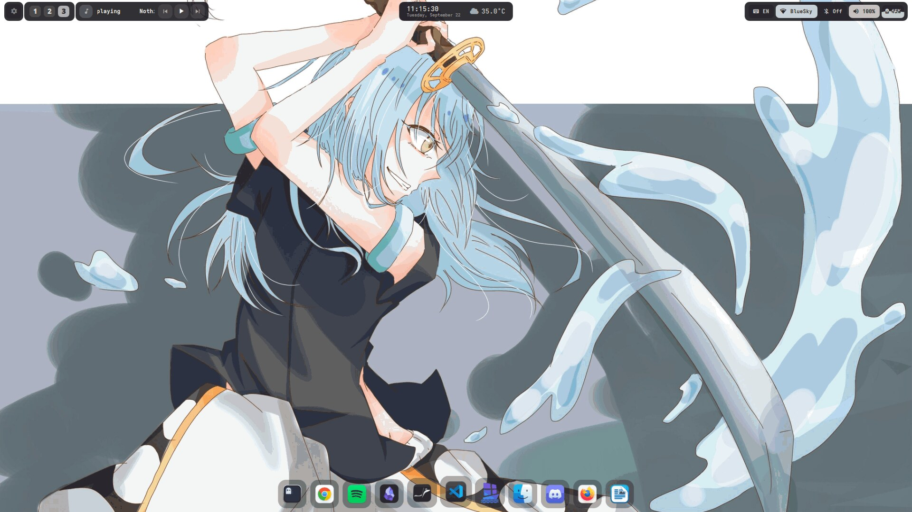
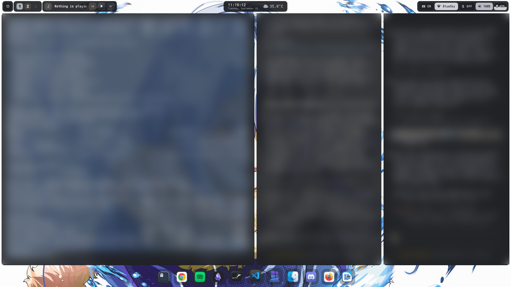
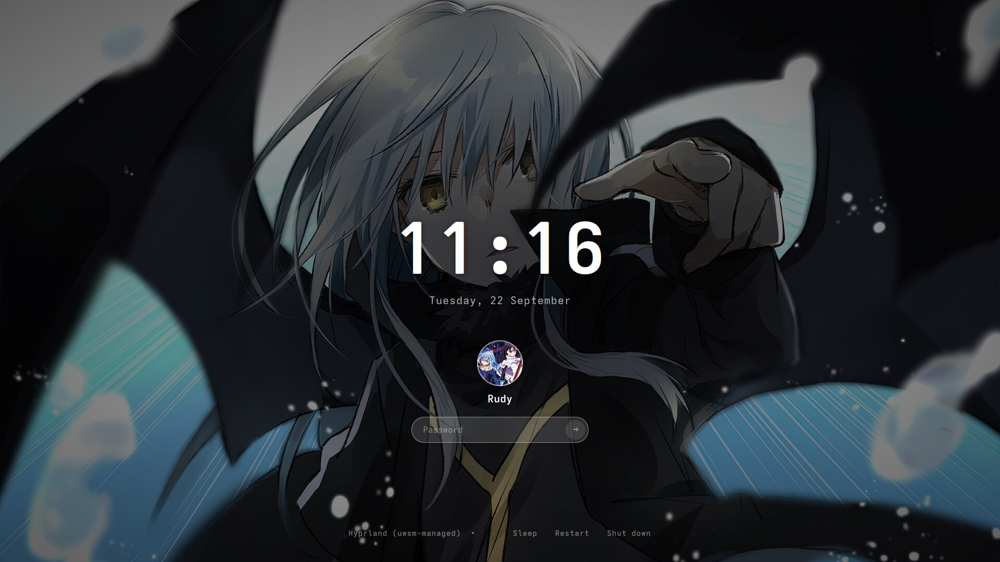

# fedora-hyprland-serpantinum-dotfiles

Hyprland + Quickshell + [Serpantinum](https://github.com/ilyamiro/serpantinum) on **Fedora 43**, with a monochrome "Obsidian" look, per-workspace wallpapers, a matching SDDM login screen, and fixes for everything that breaks when you run Serpantinum outside Arch.



| Tiling | Login screen (SDDM) |
| --- | --- |
|  |  |

> Window contents in the tiling screenshot are blurred on purpose. Wallpapers are **not** included: the art belongs to its artists. Drop in your own (see [Customization](docs/CUSTOMIZATION.md)).

## Why this exists

Serpantinum's official installer only runs on Arch-based distros (it calls `pacman`/`yay` and refuses other distros). The shell itself is plain QML and shell scripts, so it runs fine on Fedora once you:

- map ~70 Arch package names to Fedora names and pull Hyprland/Quickshell from COPR,
- build `satty` and `wl-gammarelay-rs` yourself (the satty release binary needs glibc 2.43, Fedora 43 ships 2.42),
- fix a **blank screen on Qt 6.10**: `char` is a reserved word there, and one QML file takes the whole shell down,
- put `~/.local/bin` on the session `PATH`, and set the icon theme Quickshell actually reads.

This repo does all of that with one script, and adds a few things on top.

## Features

- **Hyprland 0.56** with the Lua config, dwindle tiling, gestures, and Serpantinum's keybindings
- **Serpantinum** (bar, dock, launcher, notifications, clipboard, media, lock screen) pinned to a tested commit, with patches:
  - `0001` Qt 6.10 fix (the blank-screen bug)
  - `0002` **per-workspace wallpapers**, macOS Spaces style, instant switch with no animation
  - `0003` translucent dock icon tiles
- **Obsidian** preset: black/white/gray, Adwaita Mono, 3 workspaces shown in the bar
- **Window transparency** (92% active / 85% inactive), toggle with `Super+T`
- **Ghostty** as the terminal, **WhiteSur-dark** icons, `adw-gtk3-dark` for GTK apps
- **serpantinum-obsidian**: a custom SDDM theme (centered, card-less, your wallpaper + avatar), runs on Weston so no KDE is needed
- Optional script to **remove GNOME/KDE** safely (dry run by default, checks every dependency first)
- Telemetry in Serpantinum is **off**

## Quick start

```bash
git clone https://github.com/ruddypp/fedora-hyprland-serpantinum-dotfiles.git
cd fedora-hyprland-serpantinum-dotfiles
./install.sh                 # packages, Serpantinum + patches, configs, fonts, icons
./scripts/install-sddm.sh    # optional: matching login screen
```

Log out, choose the **Hyprland** session (not "uwsm"), log in, press `Super+H` for the built-in guide.

Full walkthrough, requirements and what each step touches: **[docs/INSTALL.md](docs/INSTALL.md)**.

## Documentation

| Doc | What's inside |
| --- | --- |
| [INSTALL.md](docs/INSTALL.md) | Requirements, step-by-step install, what gets changed, updating, uninstalling |
| [KEYBINDINGS.md](docs/KEYBINDINGS.md) | Every shortcut |
| [CUSTOMIZATION.md](docs/CUSTOMIZATION.md) | Wallpapers, avatar, transparency, browser, icons, colors, login screen |
| [TROUBLESHOOTING.md](docs/TROUBLESHOOTING.md) | Blank screen, "missing dependencies", huge UI scale, SDDM fallback theme, and more |
| [REMOVING-GNOME.md](docs/REMOVING-GNOME.md) | Going Hyprland-only, what gets removed and what must stay |
| [RESOURCES.md](docs/RESOURCES.md) | Credits and links to every project used here |

## Repository layout

```
install.sh                      main installer
packages/fedora.txt             dnf packages (Arch names already mapped)
patches/serpantinum/*.patch     applied on top of upstream Serpantinum
config/hypr/                    Hyprland Lua config + scripts/toggle-transparency.sh (-> ~/.config/hypr)
config/serpantinum/settings.json  Serpantinum settings template (-> ~/.config/serpantinum)
config/ghostty/config           Ghostty "Carbon Glass" config
scripts/install-sddm.sh         SDDM + serpantinum-obsidian theme
scripts/remove-gnome-kde.sh     optional, dry run by default
scripts/lists/                  verified package lists for the removal script
sddm/serpantinum-obsidian/      the login theme
docs/                           documentation + screenshots
```

## Tested on

- Fedora 43 Workstation (x86_64), Qt 6.10.3
- Hyprland 0.56.2 (COPR `lionheartp/Hyprland`), Quickshell 0.3.1 (COPR `errornointernet/quickshell`)
- Serpantinum 2.1.9 @ `14f5e45`
- Intel iGPU + NVIDIA MX330 (driver 580) laptop, 1920x1080

Other Fedora versions may work but are untested. Hyprland's own docs warn that point-release distros like Fedora can lag behind on dependencies.

## License

[AGPL-3.0](LICENSE), same as Serpantinum, since the patches and Hyprland config are derived from it. See [RESOURCES.md](docs/RESOURCES.md) for credits and the licenses of the other projects this setup installs.
